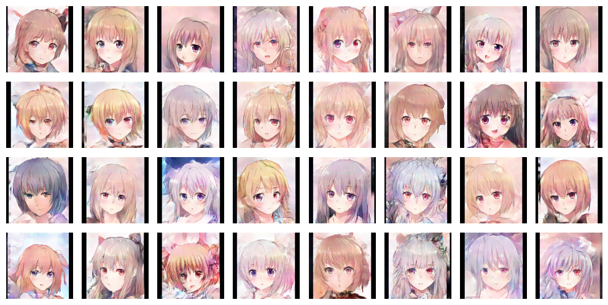
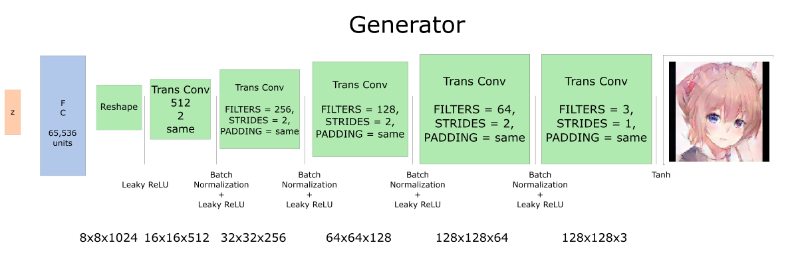
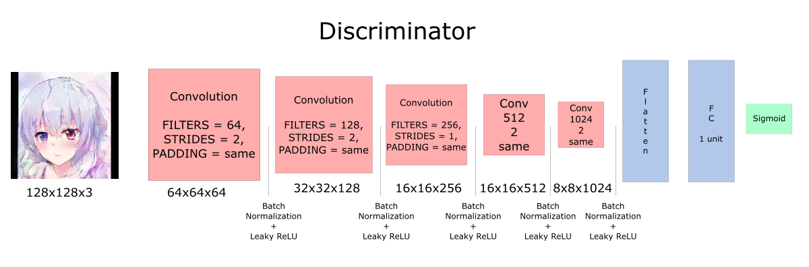

# Anime Faces with DCGAN
Pictures generated by DCGAN: 

 
Dataset-source is: <a href='https://www.kaggle.com/datasets/prasoonkottarathil/gananime-lite'> *here* </a>

Notebook related to this project also was published on the kaggle: *here*

## Inroducing
This project is the realization of the DCGAN model on the Keras. The main goal is to try to generate anime faces with a resolution of 128x128 px. The higher resolution requires more time and resources to train the model. 

## Generator architecture

## Discriminator architecture

## Training tips
Training process decsribed here: <a href='Anime Faces with DCGAN.ipynb'> *click* </a>

- For local training, I use Nvidia RTX 4050. (~12h of training 215 epochs).
 - Experiment with different train sizes for the discriminator and generator it will help you to stabilize the training. The best params is 0.00005 for the discriminator and 0.0002 for the generator. 
- Use gradient clipping to avoid exploding gradient
- You can replace BatchNormalization and Ralu layers with SELU for better training stabilization. (It increases the time of training by 6 hours) 

## Contributing 🙌
If you want to contribute to the project, your help is very welcome. This is an open source project.

 

## Acknowledgements 
This project was made possible thanks to:
- Different GAN Types decstibed here: https://www.kaggle.com/code/rezasemyari/anime-gan-by-pytorch

- Siraj's Raval PokeGan https://www.kaggle.com/code/rezasemyari/anime-gan-by-pytorch

- The choice of learning rate by Alexia Jolicoeur-Martineau https://ajolicoeur.wordpress.com/cats/
